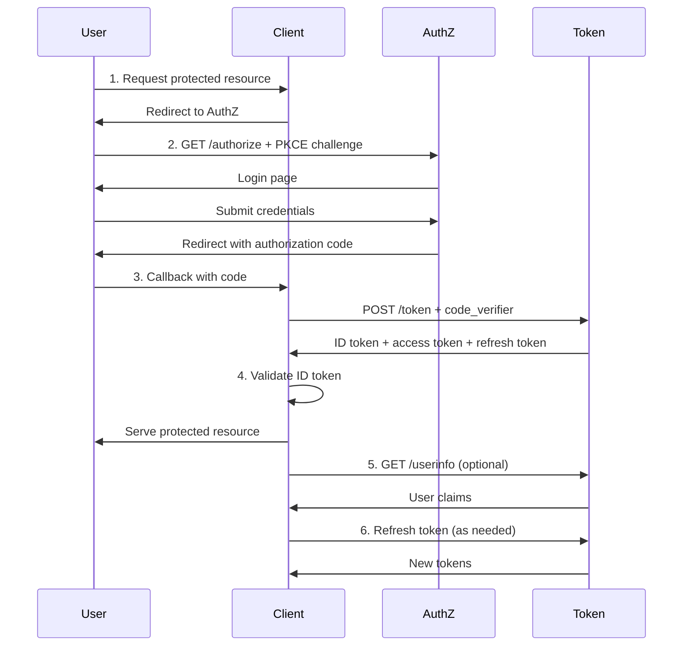
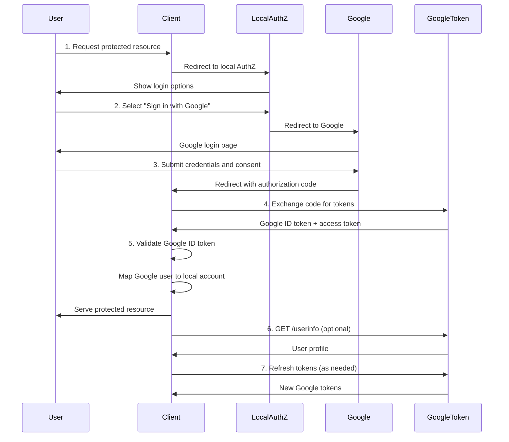

# [OIDC](https://openid.net/specs/openid-connect-core-1_0.html) Authorization Code Flow Walkthrough

This document walks through the [OpenID Connect](https://openid.net/specs/openid-connect-core-1_0.html) (OIDC) authentication flow step-by-step, showing both native authentication and third-party [federated identity](https://en.wikipedia.org/wiki/Federated_identity) scenarios.

<details>
    <summary>OIDC Flow Diagrams - Click to Expand</summary>

### Direct Authentication with Example.com



### Federated Authentication via Third-Party ([Google](https://developers.google.com/identity/protocols/oauth2/openid-connect))



</details>

---

## [OIDC Discovery](https://openid.net/specs/openid-connect-discovery-1_0.html)

Before initiating authentication, clients discover the [Authorization Server](https://openid.net/specs/openid-connect-core-1_0.html#Terminology)'s configuration using the [OIDC Discovery](https://openid.net/specs/openid-connect-discovery-1_0.html) protocol.

### Discovery Endpoint

```
GET https://auth.example.com/.well-known/openid-configuration
```

### Discovery Document Response

Returns a [JSON](https://www.json.org/) document with all [OIDC](https://openid.net/specs/openid-connect-core-1_0.html) endpoints and capabilities:

```json
{
  "issuer": "https://auth.example.com",
  "authorization_endpoint": "https://auth.example.com/authorize",
  "token_endpoint": "https://auth.example.com/oauth2/token",
  "userinfo_endpoint": "https://auth.example.com/userinfo",
  "jwks_uri": "https://auth.example.com/.well-known/jwks.json",
  "revocation_endpoint": "https://auth.example.com/oauth2/revoke",
  "end_session_endpoint": "https://auth.example.com/logout",

  "response_types_supported": ["code", "token", "id_token", "code id_token"],
  "response_modes_supported": ["query", "fragment", "form_post"],
  "grant_types_supported": ["authorization_code", "refresh_token", "client_credentials"],
  "subject_types_supported": ["public", "pairwise"],
  "id_token_signing_alg_values_supported": ["RS256", "RS384", "RS512", "ES256"],
  "token_endpoint_auth_methods_supported": ["client_secret_basic", "client_secret_post", "private_key_jwt"],

  "scopes_supported": ["openid", "profile", "email", "address", "phone", "offline_access"],
  "claims_supported": ["sub", "iss", "aud", "exp", "iat", "auth_time", "nonce", "name", "email", "picture"],

  "code_challenge_methods_supported": ["S256", "plain"]
}
```

### Benefits

- **Dynamic Configuration**: No hardcoded endpoints in client code
- **Algorithm Discovery**: Learn supported signing algorithms ([RS256](https://datatracker.ietf.org/doc/html/rfc7518#section-3.1), [ES256](https://datatracker.ietf.org/doc/html/rfc7518#section-3.4), etc.)
- **Capability Negotiation**: Discover supported flows, scopes, and authentication methods
- **JWKs Endpoint**: Location to fetch public keys for [JWT](https://datatracker.ietf.org/doc/html/rfc7519) signature validation
- **Standards Compliance**: Per [OpenID Connect Discovery 1.0](https://openid.net/specs/openid-connect-discovery-1_0.html)

---

## Flow Comparison: Native vs Federated Authentication

| Step | Native [OIDC](https://openid.net/specs/openid-connect-core-1_0.html) Authentication | Third-Party [OIDC](https://openid.net/specs/openid-connect-core-1_0.html) ([Google](https://developers.google.com/identity/protocols/oauth2/openid-connect)) |
|------|----------------------------------------------------------------------------------------------------------------|-----------------------------------------------------------------------------------------------------------------------------|
| 1    | User opens application page in browser. | User opens application page in browser. |
| 2    | Application detects no active session and redirects browser to Authorization Server:<br>`https://auth.example.com/authorize?client_id=app-client&redirect_uri=https%3A%2F%2Fapp.example.com%2Fcallback&scope=openid%20profile%20email&state=xyz&response_type=code&code_challenge=ABC&code_challenge_method=S256` | Application detects no active session and redirects browser to Authorization Server:<br>`https://auth.example.com/authorize?...` (may include [IdP](https://en.wikipedia.org/wiki/Identity_provider) hint) |
| 3    | Authorization Server shows login page (email/password fields). | Authorization Server shows login page with "Sign in with [Google](https://developers.google.com/identity/protocols/oauth2/openid-connect)" button. |
| 4    | User submits credentials. | Application redirects to [Google's Authorization Server](https://accounts.google.com):<br>`https://accounts.google.com/o/oauth2/v2/auth?client_id=google-client-id&redirect_uri=https://app.example.com/callback&scope=openid%20email%20profile&response_type=code&state=abc&nonce=nnn` |
| 5    | Authorization Server validates credentials. | [Google](https://developers.google.com/identity/protocols/oauth2/openid-connect) shows user login and consent screens. |
| 6    | On success, Authorization Server redirects browser back to application:<br>`https://app.example.com/callback?code=abc123&state=xyz` ([authorization code](https://openid.net/specs/openid-connect-core-1_0.html#CodeFlowAuth)) | On success, [Google](https://developers.google.com/identity/protocols/oauth2/openid-connect) redirects browser back to application:<br>`https://app.example.com/callback?code=xyz987&state=abc` ([authorization code](https://openid.net/specs/openid-connect-core-1_0.html#CodeFlowAuth)) |
| 7    | Application backend sends [POST](https://developer.mozilla.org/en-US/docs/Web/HTTP/Methods/POST) request to Token Endpoint:<br>`https://auth.example.com/oauth2/token`<br>with [authorization code](https://openid.net/specs/openid-connect-core-1_0.html#CodeFlowAuth) `abc123`, client credentials, [redirect_uri](https://datatracker.ietf.org/doc/html/rfc6749#section-3.1.2), [code_verifier](https://datatracker.ietf.org/doc/html/rfc7636#section-4.1) ([PKCE](https://datatracker.ietf.org/doc/html/rfc7636)).<br>Response includes:<br>- [ID token](https://openid.net/specs/openid-connect-core-1_0.html#IDToken) (user identity, [JWT](https://datatracker.ietf.org/doc/html/rfc7519))<br>- [Access token](https://datatracker.ietf.org/doc/html/rfc6749#section-1.4) ([API](https://en.wikipedia.org/wiki/API) access)<br>- [Refresh token](https://datatracker.ietf.org/doc/html/rfc6749#section-1.5) (optional, long-lived sessions) | Application backend sends [POST](https://developer.mozilla.org/en-US/docs/Web/HTTP/Methods/POST) request to [Google Token Endpoint](https://oauth2.googleapis.com/token):<br>`https://oauth2.googleapis.com/token`<br>with [authorization code](https://openid.net/specs/openid-connect-core-1_0.html#CodeFlowAuth) `xyz987`, client credentials, [redirect_uri](https://datatracker.ietf.org/doc/html/rfc6749#section-3.1.2).<br>Response includes:<br>- [ID token](https://openid.net/specs/openid-connect-core-1_0.html#IDToken) ([Google](https://developers.google.com/identity/protocols/oauth2/openid-connect) user identity, [JWT](https://datatracker.ietf.org/doc/html/rfc7519))<br>- [Access token](https://datatracker.ietf.org/doc/html/rfc6749#section-1.4)<br>Application maps [Google](https://developers.google.com/identity/protocols/oauth2/openid-connect) identity to local user account. |
| 8    | Application validates [ID token](https://openid.net/specs/openid-connect-core-1_0.html#IDToken) signature ([RS256](https://datatracker.ietf.org/doc/html/rfc7518#section-3.1)), creates session, sets [HttpOnly](https://developer.mozilla.org/en-US/docs/Web/HTTP/Cookies#restrict_access_to_cookies) cookies, and serves protected page. | Application validates [Google ID token](https://developers.google.com/identity/protocols/oauth2/openid-connect#validatinganidtoken) signature, creates session, sets [HttpOnly](https://developer.mozilla.org/en-US/docs/Web/HTTP/Cookies#restrict_access_to_cookies) cookies, and serves protected page. |

---

## Key Security Features

### [PKCE](https://datatracker.ietf.org/doc/html/rfc7636) (Proof Key for Code Exchange)
- **Prevents**: [Authorization code interception attacks](https://datatracker.ietf.org/doc/html/rfc7636#section-1) on public clients (mobile, [SPA](https://en.wikipedia.org/wiki/Single-page_application))
- **Method**: [S256](https://datatracker.ietf.org/doc/html/rfc7636#section-4.2) ([SHA-256](https://en.wikipedia.org/wiki/SHA-2)) recommended over `plain`
- **Flow**: Client generates random `code_verifier` → sends `code_challenge = BASE64URL(SHA256(code_verifier))` → server validates match

### [State Parameter](https://datatracker.ietf.org/doc/html/rfc6749#section-10.12)
- **Prevents**: [CSRF attacks](https://owasp.org/www-community/attacks/csrf) during authorization flow
- **Implementation**: Cryptographically random value, stored in session, validated on callback

### [ID Token Validation](https://openid.net/specs/openid-connect-core-1_0.html#IDTokenValidation)

Per [OIDC Core Section 3.1.3.7](https://openid.net/specs/openid-connect-core-1_0.html#IDTokenValidation), clients MUST validate [ID tokens](https://openid.net/specs/openid-connect-core-1_0.html#IDToken) using this checklist:

1. **Algorithm Validation**: Verify `alg` header matches expected algorithm ([RS256](https://datatracker.ietf.org/doc/html/rfc7518#section-3.1), [ES256](https://datatracker.ietf.org/doc/html/rfc7518#section-3.4)). MUST reject `none` algorithm.
2. **Signature Verification**: Verify [JWT](https://datatracker.ietf.org/doc/html/rfc7519) signature using [Authorization Server](https://openid.net/specs/openid-connect-core-1_0.html#Terminology)'s public key from [JWKs endpoint](https://datatracker.ietf.org/doc/html/rfc7517)
3. **Issuer (`iss`)**: MUST exactly match expected Authorization Server issuer URL
4. **Audience (`aud`)**: MUST contain client's `client_id`
5. **Authorized Party (`azp`)**: If present and `aud` contains multiple audiences, `azp` MUST match client's `client_id`
6. **Expiration (`exp`)**: Current time MUST be before expiration time
7. **Issued At (`iat`)**: Token MUST have `iat` claim (issue timestamp)
8. **Not Before (`nbf`)**: If present, current time MUST be after `nbf` timestamp
9. **Nonce**: If `nonce` was sent in authorization request, ID token MUST contain matching `nonce` claim. Prevents [token replay attacks](https://openid.net/specs/openid-connect-core-1_0.html#NonceNotes).
10. **at_hash**: If ID token issued with access token, `at_hash` claim MUST be present and match hash of access token. Prevents [token substitution attacks](https://openid.net/specs/openid-connect-core-1_0.html#ImplicitIDTValidation).
11. **c_hash**: If issued with authorization code (hybrid flow), `c_hash` must match code hash

### [OIDC Scopes](https://openid.net/specs/openid-connect-core-1_0.html#ScopeClaims)

[OIDC](https://openid.net/specs/openid-connect-core-1_0.html) defines standard scopes that control which user claims are returned:

#### Required Scope

- **`openid`** (REQUIRED): Indicates this is an [OIDC](https://openid.net/specs/openid-connect-core-1_0.html) request (not plain [OAuth2](https://datatracker.ietf.org/doc/html/rfc6749)). Triggers [ID token](https://openid.net/specs/openid-connect-core-1_0.html#IDToken) issuance.

#### Standard Optional Scopes

- **`profile`**: Requests access to default profile claims: `name`, `family_name`, `given_name`, `middle_name`, `nickname`, `preferred_username`, `profile`, `picture`, `website`, `gender`, `birthdate`, `zoneinfo`, `locale`, `updated_at`
- **`email`**: Requests `email` and `email_verified` claims
- **`address`**: Requests `address` claim (formatted address JSON object)
- **`phone`**: Requests `phone_number` and `phone_number_verified` claims
- **`offline_access`**: Requests a [refresh token](https://datatracker.ietf.org/doc/html/rfc6749#section-1.5) for offline access (long-lived sessions)

#### Custom Scopes

Authorization Servers can define custom scopes for application-specific claims (e.g., `employee_id`, `department`, `role`).

### [UserInfo Endpoint](https://openid.net/specs/openid-connect-core-1_0.html#UserInfo)

The [UserInfo Endpoint](https://openid.net/specs/openid-connect-core-1_0.html#UserInfo) ([OIDC Core Section 5.3](https://openid.net/specs/openid-connect-core-1_0.html#UserInfo)) returns additional user claims beyond those in the [ID token](https://openid.net/specs/openid-connect-core-1_0.html#IDToken).

**Endpoint**: `GET https://auth.example.com/userinfo`

**Authentication**: Requires valid [access token](https://datatracker.ietf.org/doc/html/rfc6749#section-1.4) in `Authorization: Bearer {token}` header

**Response**: [JSON](https://www.json.org/) object with user claims based on requested scopes:

```json
{
  "sub": "248289761001",
  "name": "Jane Doe",
  "given_name": "Jane",
  "family_name": "Doe",
  "preferred_username": "jane.doe",
  "email": "jane.doe@example.com",
  "email_verified": true,
  "picture": "https://example.com/jane.jpg",
  "updated_at": 1311280970
}
```

**Use Cases**:
- Fetching large claims that don't fit in [ID token](https://openid.net/specs/openid-connect-core-1_0.html#IDToken) (e.g., detailed address)
- Retrieving fresh user data after ID token issued
- Accessing claims not included in ID token's scope

### [Token Endpoint Authentication](https://openid.net/specs/openid-connect-core-1_0.html#ClientAuthentication)

Per [OIDC Core Section 9](https://openid.net/specs/openid-connect-core-1_0.html#ClientAuthentication), clients authenticate to the token endpoint using one of these methods:

#### Confidential Clients (Backend Servers)

- **`client_secret_basic`** (RECOMMENDED): [HTTP Basic authentication](https://datatracker.ietf.org/doc/html/rfc7617) with `client_id:client_secret` in `Authorization` header
  ```
  Authorization: Basic BASE64(client_id:client_secret)
  ```

- **`client_secret_post`**: Send `client_id` and `client_secret` in [POST](https://developer.mozilla.org/en-US/docs/Web/HTTP/Methods/POST) body
  ```
  POST /oauth2/token
  Content-Type: application/x-www-form-urlencoded

  client_id=abc&client_secret=xyz&grant_type=authorization_code&code=...
  ```

- **`client_secret_jwt`**: Client creates [JWT](https://datatracker.ietf.org/doc/html/rfc7519) signed with shared secret ([HS256](https://datatracker.ietf.org/doc/html/rfc7518#section-3.2))

- **`private_key_jwt`** (MOST SECURE): Client creates [JWT](https://datatracker.ietf.org/doc/html/rfc7519) signed with private key ([RS256](https://datatracker.ietf.org/doc/html/rfc7518#section-3.1), [ES256](https://datatracker.ietf.org/doc/html/rfc7518#section-3.4)). Server validates with client's public key.

#### Public Clients (Mobile, SPA)

- **No client secret**: Public clients cannot securely store secrets
- **PKCE REQUIRED**: Use [PKCE](https://datatracker.ietf.org/doc/html/rfc7636) (`code_verifier`) to authenticate the client
- **Send `client_id` only**: No `client_secret` in token request

### Error Handling

Per [OIDC Core Section 3.1.2.6](https://openid.net/specs/openid-connect-core-1_0.html#AuthError) and [OAuth2 RFC 6749 Section 4.1.2.1](https://datatracker.ietf.org/doc/html/rfc6749#section-4.1.2.1):

#### Authorization Endpoint Errors

**Invalid `redirect_uri`**:
- **Response**: Error page (DO NOT redirect - prevents open redirect attacks)
- **Reason**: Cannot safely redirect if `redirect_uri` is invalid

**Valid `redirect_uri`, other errors**:
- **Response**: Redirect to `redirect_uri` with error parameters
- **Format**: `https://app.example.com/callback?error=ERROR_CODE&error_description=DESCRIPTION&state=STATE`

**Common Error Codes**:
- `invalid_request`: Missing or invalid required parameter
- `unauthorized_client`: Client not authorized for this grant type
- `access_denied`: User denied authorization
- `unsupported_response_type`: Authorization server doesn't support this `response_type`
- `invalid_scope`: Requested scope is invalid or unknown
- `server_error`: Internal server error (HTTP 500 equivalent)
- `temporarily_unavailable`: Server temporarily unavailable (HTTP 503 equivalent)

#### Token Endpoint Errors

**Response Format**: [JSON](https://www.json.org/) with HTTP 400 status

```json
{
  "error": "invalid_grant",
  "error_description": "Authorization code has expired"
}
```

**Common Error Codes**:
- `invalid_request`: Malformed request
- `invalid_client`: Client authentication failed
- `invalid_grant`: Authorization code invalid, expired, or revoked
- `unauthorized_client`: Client not authorized for this grant type
- `unsupported_grant_type`: Grant type not supported
- `invalid_scope`: Requested scope exceeds authorized scope

### [Token Lifetimes](https://datatracker.ietf.org/doc/html/rfc6749#section-10.3)
- **Access Token**: Short-lived (15 minutes) - minimizes exposure
- **Refresh Token**: Longer-lived (30 days) - enables [token rotation](https://datatracker.ietf.org/doc/html/rfc6749#section-10.4)
- **ID Token**: Matches access token lifetime

---

## Implementation Notes

This walkthrough demonstrates the [OIDC Authorization Code Flow](https://openid.net/specs/openid-connect-core-1_0.html#CodeFlowAuth) as implemented in [Project 1](../README.md). For complete implementation details, see:

- [PRD](PRD.md) - Product Requirements Document
- [../pkg/models/oidc.go](../pkg/models/oidc.go) - [OIDC](https://openid.net/specs/openid-connect-core-1_0.html) data models
- [../internal/tokens/jwt.go](../internal/tokens/jwt.go) - [JWT](https://datatracker.ietf.org/doc/html/rfc7519) token generation/validation
- [../internal/tokens/pkce.go](../internal/tokens/pkce.go) - [PKCE](https://datatracker.ietf.org/doc/html/rfc7636) validation

---

## References

- [OpenID Connect Core 1.0](https://openid.net/specs/openid-connect-core-1_0.html)
- [OAuth 2.0 Authorization Framework (RFC 6749)](https://datatracker.ietf.org/doc/html/rfc6749)
- [PKCE Extension (RFC 7636)](https://datatracker.ietf.org/doc/html/rfc7636)
- [JSON Web Token (RFC 7519)](https://datatracker.ietf.org/doc/html/rfc7519)
- [Google OpenID Connect](https://developers.google.com/identity/protocols/oauth2/openid-connect)
- [OWASP Authentication Cheat Sheet](https://cheatsheetseries.owasp.org/cheatsheets/Authentication_Cheat_Sheet.html)