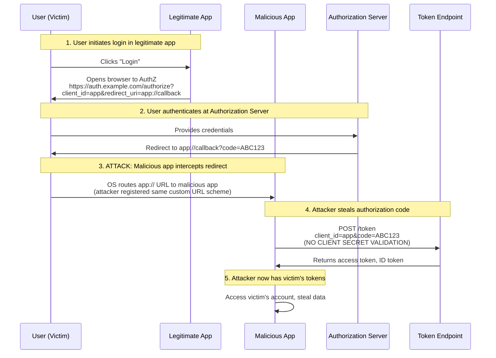
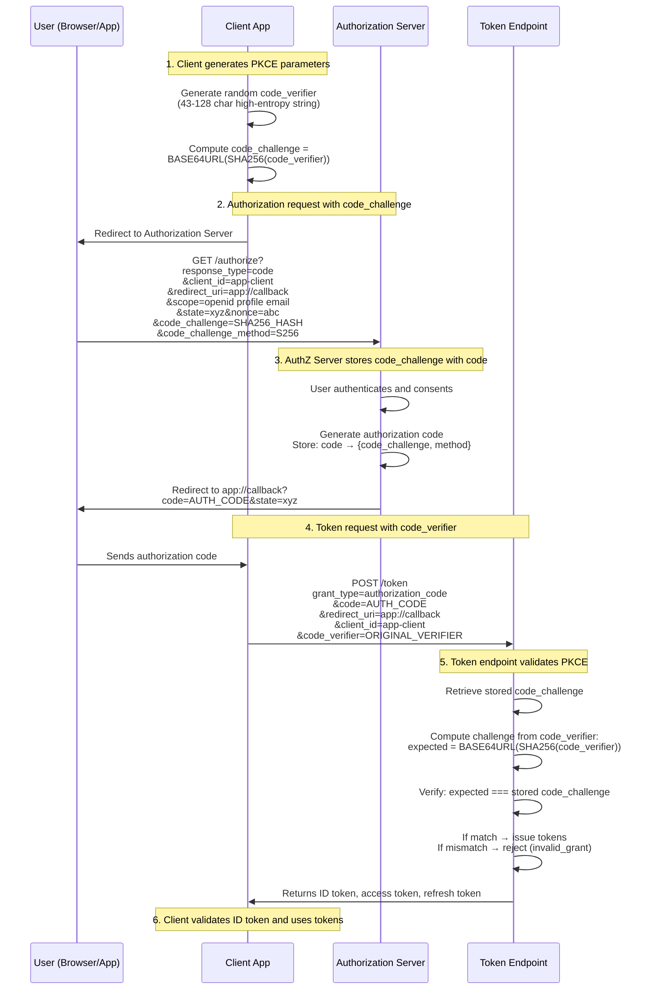

# [PKCE](https://datatracker.ietf.org/doc/html/rfc7636) Deep Dive: Proof Key for Code Exchange

This document provides a comprehensive exploration of [PKCE (RFC 7636)](https://datatracker.ietf.org/doc/html/rfc7636), building on the [OIDC Authorization Code Flow](OIDC_Walk_Thru.md) concepts.

## Prerequisites

Before reading this document, ensure you understand:
- [OAuth2 Authorization Code Flow](https://datatracker.ietf.org/doc/html/rfc6749#section-4.1) basics
- [OIDC Authorization Code Flow](OIDC_Walk_Thru.md) from the companion walkthrough
- [JWT tokens](https://datatracker.ietf.org/doc/html/rfc7519) and token validation
- Browser redirect-based flows

---

## Table of Contents

1. [The Problem PKCE Solves](#the-problem-pkce-solves)
2. [PKCE Flow Walkthrough](#pkce-flow-walkthrough)
3. [PKCE Parameters](#pkce-parameters)
4. [Code Challenge Methods](#code-challenge-methods)
5. [Attack Scenarios Prevented](#attack-scenarios-prevented)
6. [Implementation Examples](#implementation-examples)
7. [Security Considerations](#security-considerations)
8. [PKCE vs Client Secret](#pkce-vs-client-secret)
9. [Best Practices](#best-practices)

---

## The Problem [PKCE](https://datatracker.ietf.org/doc/html/rfc7636) Solves

### Background: Public Clients

**Public clients** are applications that cannot securely store secrets:
- **[Single-Page Applications](https://en.wikipedia.org/wiki/Single-page_application) (SPA)**: JavaScript code visible in browser, easily inspected
- **Mobile Apps**: APK/IPA files can be decompiled to extract hardcoded secrets
- **Desktop Apps**: Binaries can be reverse-engineered
- **Command-Line Tools**: Configuration files readable by user

### The Authorization Code Interception Attack

Per [RFC 7636 Section 1](https://datatracker.ietf.org/doc/html/rfc7636#section-1), public clients using [Authorization Code Flow](https://datatracker.ietf.org/doc/html/rfc6749#section-4.1) are vulnerable to **authorization code interception**:



### Why This Attack Works

1. **No Client Secret**: Public clients can't securely store `client_secret`, so token endpoint cannot validate client authenticity
2. **Custom URL Schemes**: Mobile apps use custom schemes (`app://callback`) that can be registered by multiple apps
3. **Authorization Code is Bearer Token**: Anyone with the code can exchange it for tokens (no proof of possession)

### PKCE Solution

[PKCE](https://datatracker.ietf.org/doc/html/rfc7636) adds **cryptographic proof of possession** to the authorization code flow:

1. Client generates random `code_verifier` (high-entropy secret)
2. Client derives `code_challenge` from `code_verifier` using [SHA-256](https://en.wikipedia.org/wiki/SHA-2)
3. Authorization request includes `code_challenge`
4. Token request includes `code_verifier`
5. Authorization Server validates that `code_verifier` matches the original `code_challenge`

**Result**: Even if attacker intercepts authorization code, they cannot exchange it without the original `code_verifier` (which never leaves the client).

---

## [PKCE](https://datatracker.ietf.org/doc/html/rfc7636) Flow Walkthrough



### Step-by-Step Breakdown

#### Step 1: Client Generates PKCE Parameters

**Code Verifier Generation** ([RFC 7636 Section 4.1](https://datatracker.ietf.org/doc/html/rfc7636#section-4.1)):
```
code_verifier = high-entropy random string
- Length: 43 to 128 characters
- Character set: [A-Z] [a-z] [0-9] - . _ ~ (unreserved characters)
- Entropy: Minimum 256 bits recommended
```

**Example**:
```
code_verifier = "dBjftJeZ4CVP-mB92K27uhbUJU1p1r_wW1gFWFOEjXk"
```

**Code Challenge Derivation** ([RFC 7636 Section 4.2](https://datatracker.ietf.org/doc/html/rfc7636#section-4.2)):
```
code_challenge = BASE64URL(SHA256(ASCII(code_verifier)))
```

**Example**:
```javascript
// JavaScript example
const code_verifier = "dBjftJeZ4CVP-mB92K27uhbUJU1p1r_wW1gFWFOEjXk";
const encoder = new TextEncoder();
const data = encoder.encode(code_verifier);
const hash = await crypto.subtle.digest('SHA-256', data);
const code_challenge = base64UrlEncode(hash);
// Result: "E9Melhoa2OwvFrEMTJguCHaoeK1t8URWbuGJSstw-cM"
```

#### Step 2: Authorization Request with `code_challenge`

```
GET https://auth.example.com/authorize?
  response_type=code
  &client_id=mobile-app
  &redirect_uri=app://callback
  &scope=openid profile email
  &state=xyz123
  &nonce=abc456
  &code_challenge=E9Melhoa2OwvFrEMTJguCHaoeK1t8URWbuGJSstw-cM
  &code_challenge_method=S256
```

**New Parameters**:
- `code_challenge`: [SHA-256](https://en.wikipedia.org/wiki/SHA-2) hash of `code_verifier` (base64url-encoded)
- `code_challenge_method`: Hash algorithm used (`S256` = [SHA-256](https://en.wikipedia.org/wiki/SHA-2), `plain` = no hashing)

#### Step 3: Authorization Server Stores Challenge

Authorization Server:
1. Validates request parameters
2. Authenticates user
3. Obtains user consent
4. Generates authorization code
5. **Stores association**: `code` → `{code_challenge, code_challenge_method, client_id, redirect_uri}`
6. Redirects user back to client with authorization code

```
HTTP/1.1 302 Found
Location: app://callback?code=AUTH_CODE_123&state=xyz123
```

#### Step 4: Token Request with `code_verifier`

Client receives authorization code and sends token request:

```
POST /oauth2/token HTTP/1.1
Host: auth.example.com
Content-Type: application/x-www-form-urlencoded

grant_type=authorization_code
&code=AUTH_CODE_123
&redirect_uri=app://callback
&client_id=mobile-app
&code_verifier=dBjftJeZ4CVP-mB92K27uhbUJU1p1r_wW1gFWFOEjXk
```

**Key Point**: Client sends original `code_verifier` (NOT the hashed `code_challenge`)

#### Step 5: Token Endpoint Validates PKCE

Authorization Server validation logic ([RFC 7636 Section 4.6](https://datatracker.ietf.org/doc/html/rfc7636#section-4.6)):

```python
# Pseudocode
def validate_pkce(code, code_verifier):
    # 1. Retrieve stored challenge for this code
    stored = get_stored_challenge(code)
    if not stored:
        return error("invalid_grant", "Authorization code not found")

    # 2. Check code_verifier presence
    if stored.code_challenge and not code_verifier:
        return error("invalid_grant", "code_verifier required")

    # 3. Validate code_verifier format
    if not is_valid_verifier(code_verifier):  # 43-128 chars, unreserved
        return error("invalid_request", "Invalid code_verifier format")

    # 4. Compute expected challenge
    if stored.code_challenge_method == "S256":
        expected_challenge = base64url(sha256(code_verifier))
    elif stored.code_challenge_method == "plain":
        expected_challenge = code_verifier
    else:
        return error("invalid_request", "Unsupported challenge method")

    # 5. Constant-time comparison to prevent timing attacks
    if not constant_time_compare(expected_challenge, stored.code_challenge):
        return error("invalid_grant", "code_verifier does not match")

    # 6. PKCE validation passed - issue tokens
    return issue_tokens(code)
```

#### Step 6: Tokens Issued

If PKCE validation succeeds, token endpoint returns:

```json
{
  "access_token": "eyJhbGci...",
  "token_type": "Bearer",
  "expires_in": 900,
  "refresh_token": "8xLOxBtZp8...",
  "id_token": "eyJhbGci..."
}
```

---

## [PKCE](https://datatracker.ietf.org/doc/html/rfc7636) Parameters

### Authorization Request Parameters

| Parameter | Required | Description | Example |
|-----------|----------|-------------|---------|
| `code_challenge` | **Yes** (for PKCE) | [Base64url](https://datatracker.ietf.org/doc/html/rfc4648#section-5)-encoded [SHA-256](https://en.wikipedia.org/wiki/SHA-2) hash of `code_verifier` | `E9Melhoa2OwvFrEMTJguCHaoeK1t8URWbuGJSstw-cM` |
| `code_challenge_method` | **Recommended** | Hash method: `S256` or `plain`. Defaults to `plain` if omitted. | `S256` |

### Token Request Parameters

| Parameter | Required | Description | Example |
|-----------|----------|-------------|---------|
| `code_verifier` | **Yes** (if `code_challenge` was sent) | Original high-entropy random string (43-128 chars) | `dBjftJeZ4CVP-mB92K27uhbUJU1p1r_wW1gFWFOEjXk` |

---

## Code Challenge Methods

Per [RFC 7636 Section 4.2](https://datatracker.ietf.org/doc/html/rfc7636#section-4.2):

### S256 (RECOMMENDED)

```
code_challenge = BASE64URL(SHA256(ASCII(code_verifier)))
```

**Advantages**:
- **Cryptographically secure**: Cannot reverse [SHA-256](https://en.wikipedia.org/wiki/SHA-2) to obtain `code_verifier`
- **Safe for logs**: Even if `code_challenge` is logged, attacker cannot derive `code_verifier`
- **Industry standard**: Required by [OAuth 2.0 for Native Apps (BCP 212)](https://datatracker.ietf.org/doc/html/rfc8252)

**Implementation**:
```go
// Go example
import (
    "crypto/sha256"
    "encoding/base64"
)

func computeCodeChallenge(verifier string) string {
    hash := sha256.Sum256([]byte(verifier))
    return base64.RawURLEncoding.EncodeToString(hash[:])
}
```

### plain (NOT RECOMMENDED)

```
code_challenge = code_verifier
```

**Use Cases**:
- Clients that cannot perform [SHA-256](https://en.wikipedia.org/wiki/SHA-2) hashing (extremely rare)
- Legacy environments without crypto libraries

**Security Considerations**:
- **Less secure**: `code_challenge` reveals `code_verifier` if logged
- **Use only if S256 impossible**: Modern platforms all support [SHA-256](https://en.wikipedia.org/wiki/SHA-2)

---

## Attack Scenarios Prevented

### 1. Authorization Code Interception (Mobile)

**Attack**: Malicious app registers same custom [URL scheme](https://developer.apple.com/documentation/xcode/defining-a-custom-url-scheme-for-your-app) and intercepts redirect

**Without PKCE**:
```
Attacker intercepts: app://callback?code=ABC123
Attacker exchanges code for tokens ✅ (SUCCESS - No validation)
```

**With PKCE**:
```
Attacker intercepts: app://callback?code=ABC123
Attacker sends token request without code_verifier ❌ (FAILURE)
Attacker guesses code_verifier ❌ (2^256 possibilities with S256)
```

### 2. Authorization Code Injection

**Attack**: Attacker tricks victim into using attacker's authorization code

**Scenario**:
1. Attacker initiates login, obtains authorization code
2. Attacker injects their code into victim's session
3. Victim exchanges code for tokens
4. Result: Victim's account linked to attacker's identity

**With PKCE**:
Victim's client has different `code_verifier` than attacker's, so token exchange fails.

### 3. Compromised Communication Channel

**Attack**: Network attacker intercepts authorization code via [Man-in-the-Middle](https://en.wikipedia.org/wiki/Man-in-the-middle_attack)

**Without PKCE**:
```
Attacker intercepts code over HTTP (or compromised HTTPS)
Attacker exchanges code for tokens ✅ (SUCCESS)
```

**With PKCE**:
```
Attacker intercepts code ✓
Attacker lacks code_verifier (never transmitted) ❌ (FAILURE)
```

---

## Implementation Examples

### JavaScript (Browser/Node.js)

```javascript
// PKCE parameter generation
async function generatePKCEParams() {
  // Generate code_verifier (43-128 characters)
  const array = new Uint8Array(32); // 32 bytes = 256 bits
  crypto.getRandomValues(array);
  const code_verifier = base64UrlEncode(array);

  // Compute code_challenge using SHA-256
  const encoder = new TextEncoder();
  const data = encoder.encode(code_verifier);
  const hashBuffer = await crypto.subtle.digest('SHA-256', data);
  const code_challenge = base64UrlEncode(new Uint8Array(hashBuffer));

  return { code_verifier, code_challenge, code_challenge_method: 'S256' };
}

function base64UrlEncode(buffer) {
  const base64 = btoa(String.fromCharCode(...buffer));
  return base64.replace(/\+/g, '-').replace(/\//g, '_').replace(/=/g, '');
}

// Usage
const pkce = await generatePKCEParams();
// Store code_verifier in sessionStorage
sessionStorage.setItem('code_verifier', pkce.code_verifier);

// Build authorization URL
const authUrl = `https://auth.example.com/authorize?` +
  `response_type=code` +
  `&client_id=spa-client` +
  `&redirect_uri=${encodeURIComponent('https://app.example.com/callback')}` +
  `&scope=openid profile email` +
  `&state=${generateRandomState()}` +
  `&nonce=${generateRandomNonce()}` +
  `&code_challenge=${pkce.code_challenge}` +
  `&code_challenge_method=S256`;

window.location.href = authUrl;
```

### Go (Backend or CLI)

```go
package main

import (
    "crypto/rand"
    "crypto/sha256"
    "encoding/base64"
    "fmt"
)

// GeneratePKCEParams creates code_verifier and code_challenge
func GeneratePKCEParams() (verifier, challenge string, err error) {
    // Generate 32-byte (256-bit) random verifier
    verifierBytes := make([]byte, 32)
    if _, err := rand.Read(verifierBytes); err != nil {
        return "", "", err
    }
    verifier = base64.RawURLEncoding.EncodeToString(verifierBytes)

    // Compute SHA-256 hash and encode as base64url
    hash := sha256.Sum256([]byte(verifier))
    challenge = base64.RawURLEncoding.EncodeToString(hash[:])

    return verifier, challenge, nil
}

// ValidatePKCE validates code_verifier against code_challenge (server-side)
func ValidatePKCE(codeVerifier, codeChallenge, method string) error {
    if codeChallenge == "" {
        return nil // PKCE not used for this request
    }

    if codeVerifier == "" {
        return fmt.Errorf("code_verifier required when code_challenge was provided")
    }

    // Validate verifier length (43-128 characters)
    if len(codeVerifier) < 43 || len(codeVerifier) > 128 {
        return fmt.Errorf("code_verifier must be 43-128 characters, got %d", len(codeVerifier))
    }

    // Compute expected challenge
    var expectedChallenge string
    switch method {
    case "S256":
        hash := sha256.Sum256([]byte(codeVerifier))
        expectedChallenge = base64.RawURLEncoding.EncodeToString(hash[:])
    case "plain":
        expectedChallenge = codeVerifier
    default:
        return fmt.Errorf("unsupported code_challenge_method: %s", method)
    }

    // Constant-time comparison to prevent timing attacks
    if !constantTimeCompare(expectedChallenge, codeChallenge) {
        return fmt.Errorf("code_verifier does not match code_challenge")
    }

    return nil
}
```

### Swift (iOS)

```swift
import Foundation
import CommonCrypto

struct PKCEParams {
    let codeVerifier: String
    let codeChallenge: String
    let codeChallengeMethod: String = "S256"
}

func generatePKCEParams() -> PKCEParams {
    // Generate 32-byte random verifier
    var buffer = [UInt8](repeating: 0, count: 32)
    let result = SecRandomCopyBytes(kSecRandomDefault, buffer.count, &buffer)
    guard result == errSecSuccess else {
        fatalError("Failed to generate random bytes")
    }

    let codeVerifier = Data(buffer).base64URLEncodedString()

    // Compute SHA-256 challenge
    let verifierData = codeVerifier.data(using: .ascii)!
    var hash = [UInt8](repeating: 0, count: Int(CC_SHA256_DIGEST_LENGTH))
    verifierData.withUnsafeBytes { ptr in
        _ = CC_SHA256(ptr.baseAddress, CC_LONG(verifierData.count), &hash)
    }

    let codeChallenge = Data(hash).base64URLEncodedString()

    return PKCEParams(codeVerifier: codeVerifier, codeChallenge: codeChallenge)
}

extension Data {
    func base64URLEncodedString() -> String {
        return self.base64EncodedString()
            .replacingOccurrences(of: "+", with: "-")
            .replacingOccurrences(of: "/", with: "_")
            .replacingOccurrences(of: "=", with: "")
    }
}
```

---

## Security Considerations

### Entropy Requirements

Per [RFC 7636 Section 4.1](https://datatracker.ietf.org/doc/html/rfc7636#section-4.1):
- **Minimum**: 256 bits of entropy
- **Length**: 43-128 characters (43 chars ≈ 256 bits with base64url)
- **Character Set**: Unreserved characters `[A-Za-z0-9-._~]`

**Bad Example** (Low Entropy):
```javascript
const code_verifier = "12345"; // ❌ Only 17 bits entropy
```

**Good Example** (High Entropy):
```javascript
const buffer = new Uint8Array(32); // 32 bytes = 256 bits
crypto.getRandomValues(buffer);
const code_verifier = base64UrlEncode(buffer); // ✅ 256 bits entropy
```

### Storage Security

- **`code_verifier`**:
  - Store securely in client (sessionStorage for web, Keychain for iOS, KeyStore for Android)
  - NEVER send to server before token exchange
  - Delete after successful token exchange

- **`code_challenge`**:
  - Safe to log (one-way hash, cannot reverse)
  - Included in authorization request (sent to server)

### Timing Attack Protection

Token endpoint MUST use **constant-time comparison** when validating `code_verifier`:

```go
// ✅ Correct: Constant-time comparison
func constantTimeCompare(a, b string) bool {
    return subtle.ConstantTimeCompare([]byte(a), []byte(b)) == 1
}

// ❌ Wrong: Early exit leaks timing information
func insecureCompare(a, b string) bool {
    if len(a) != len(b) {
        return false // Early exit leaks length
    }
    for i := range a {
        if a[i] != b[i] {
            return false // Early exit leaks position
        }
    }
    return true
}
```

### HTTPS Requirement

- **MUST use HTTPS** for authorization and token endpoints ([RFC 6749 Section 3.1](https://datatracker.ietf.org/doc/html/rfc6749#section-3.1))
- [PKCE](https://datatracker.ietf.org/doc/html/rfc7636) adds defense-in-depth but does NOT replace [HTTPS](https://en.wikipedia.org/wiki/HTTPS)
- Custom URL schemes (`app://callback`) don't use [HTTPS](https://en.wikipedia.org/wiki/HTTPS), which is why [PKCE](https://datatracker.ietf.org/doc/html/rfc7636) is critical for mobile

---

## [PKCE](https://datatracker.ietf.org/doc/html/rfc7636) vs Client Secret

### Confidential Clients (Backend Servers)

| Feature | Client Secret | PKCE |
|---------|--------------|------|
| **Client Type** | Confidential (server-side) | Public (browser, mobile) |
| **Secret Storage** | Secure server environment | Cannot store secrets |
| **Authentication** | `client_id` + `client_secret` | `client_id` + PKCE proof |
| **Rotation** | Requires secret rotation | New verifier per request |
| **Interception Risk** | Low (server-to-server) | High (mobile redirects) |

**Recommendation**: Use `client_secret` for backend servers.

### Public Clients (Mobile, SPA, CLI)

| Feature | Client Secret (❌ Insecure) | PKCE (✅ Secure) |
|---------|---------------------------|-----------------|
| **Secret Exposure** | Hardcoded in app, easily extracted | No secret to extract |
| **Code Interception** | Attacker can exchange code | Attacker blocked without verifier |
| **Decompilation Risk** | Secret leaked if app decompiled | No hardcoded secret to leak |
| **Per-Request Security** | Same secret for all requests | Unique verifier per request |

**Recommendation**: Use [PKCE](https://datatracker.ietf.org/doc/html/rfc7636) for all public clients. NEVER hardcode `client_secret`.

### Confidential Clients with PKCE (Defense in Depth)

Even confidential clients CAN use [PKCE](https://datatracker.ietf.org/doc/html/rfc7636) for **defense in depth**:

```
POST /oauth2/token
client_id=backend-app
&client_secret=xyz789           ← Confidential client authentication
&code=ABC123
&code_verifier=original_verifier ← PKCE proof (extra security layer)
```

**Benefits**:
- Protection if `client_secret` accidentally leaked
- Protection against authorization code injection
- Recommended by [OAuth 2.1 (draft)](https://datatracker.ietf.org/doc/html/draft-ietf-oauth-v2-1-07)

---

## Best Practices

### 1. Always Use S256

```
✅ code_challenge_method=S256
❌ code_challenge_method=plain
```

**Reason**: `S256` prevents `code_verifier` leakage if `code_challenge` is logged.

### 2. Generate Fresh Verifier Per Request

```javascript
// ❌ Bad: Reusing verifier across requests
const code_verifier = "static_verifier_123";

// ✅ Good: Fresh random verifier per authorization request
const code_verifier = generateRandomVerifier();
```

**Reason**: Unique verifiers limit damage if one is compromised.

### 3. Validate Verifier Format (Server-Side)

```python
def is_valid_verifier(verifier):
    if not (43 <= len(verifier) <= 128):
        return False
    if not re.match(r'^[A-Za-z0-9\-._~]+$', verifier):
        return False
    return True
```

**Reason**: Prevents malformed verifiers that could cause security issues.

### 4. Use Constant-Time Comparison

```go
// ✅ Correct
if subtle.ConstantTimeCompare([]byte(expected), []byte(actual)) != 1 {
    return errors.New("invalid verifier")
}

// ❌ Wrong - timing attack vulnerability
if expected != actual {
    return errors.New("invalid verifier")
}
```

**Reason**: Prevents timing attacks that could leak verifier bytes.

### 5. Delete Verifier After Use

```javascript
// After successful token exchange
sessionStorage.removeItem('code_verifier');
```

**Reason**: Minimize exposure window if storage compromised.

### 6. Require PKCE for Public Clients (Server-Side)

```go
func (s *TokenEndpoint) validatePKCE(client *Client, req *TokenRequest) error {
    if client.IsPublic() && req.CodeChallenge == "" {
        return errors.New("PKCE required for public clients")
    }
    // ... validate PKCE
}
```

**Reason**: Enforce security policy at authorization server.

### 7. Support PKCE for All Clients

Per [OAuth 2.1 (draft)](https://datatracker.ietf.org/doc/html/draft-ietf-oauth-v2-1-07), ALL clients SHOULD support [PKCE](https://datatracker.ietf.org/doc/html/rfc7636):

```
Public clients (mobile, SPA):    MUST use PKCE
Confidential clients (backend):  SHOULD use PKCE (defense in depth)
```

---

## Migration Guide: Adding PKCE to Existing Flow

### Client Changes

1. **Add PKCE generation before authorization request**:
   ```javascript
   const { code_verifier, code_challenge } = await generatePKCEParams();
   sessionStorage.setItem('code_verifier', code_verifier);
   ```

2. **Include `code_challenge` in authorization URL**:
   ```javascript
   authUrl += `&code_challenge=${code_challenge}&code_challenge_method=S256`;
   ```

3. **Include `code_verifier` in token request**:
   ```javascript
   const code_verifier = sessionStorage.getItem('code_verifier');
   tokenRequest.body = `...&code_verifier=${code_verifier}`;
   ```

### Server Changes

1. **Store `code_challenge` with authorization code** (authorization endpoint)
2. **Validate `code_verifier` against stored `code_challenge`** (token endpoint)
3. **Return `invalid_grant` error if validation fails**

### Backward Compatibility

To support clients without [PKCE](https://datatracker.ietf.org/doc/html/rfc7636):

```python
# Token endpoint
if code_challenge:
    # PKCE used - validate it
    validate_pkce(code_verifier, code_challenge, method)
else:
    # PKCE not used
    if client.is_public:
        # Reject: Public clients MUST use PKCE
        return error("invalid_request", "PKCE required")
    else:
        # Allow: Confidential client with client_secret
        validate_client_secret(client_id, client_secret)
```

---

## Implementation in This Project

This [OIDC](https://openid.net/specs/openid-connect-core-1_0.html) authorization server implements [PKCE](https://datatracker.ietf.org/doc/html/rfc7636) per [RFC 7636](https://datatracker.ietf.org/doc/html/rfc7636):

- **[PKCE Validation Logic](../internal/tokens/pkce.go)**: Server-side validation with S256 and plain support
- **[Authorization Code Storage](../internal/session/redis.go)**: Stores `code_challenge` with authorization code
- **[OAuth2 Models](../pkg/models/oauth2.go)**: Data structures for PKCE parameters
- **[PRD](PRD.md)**: Product requirements for PKCE implementation

---

## Additional Resources

### Specifications
- [RFC 7636: Proof Key for Code Exchange (PKCE)](https://datatracker.ietf.org/doc/html/rfc7636)
- [RFC 8252: OAuth 2.0 for Native Apps](https://datatracker.ietf.org/doc/html/rfc8252) (requires PKCE)
- [OAuth 2.1 (draft)](https://datatracker.ietf.org/doc/html/draft-ietf-oauth-v2-1-07) (mandates PKCE for all clients)

### Security Analysis
- [OWASP Mobile Security Testing Guide - OAuth2](https://mas.owasp.org/MASTG/tests/android/MASVS-AUTH/MASTG-TEST-0064/)
- [Authorization Code Interception Attack](https://datatracker.ietf.org/doc/html/rfc7636#section-1)

### Implementation Guides
- [Auth0: PKCE for OAuth Public Clients](https://auth0.com/docs/get-started/authentication-and-authorization-flow/authorization-code-flow-with-proof-key-for-code-exchange-pkce)
- [Okta: Implement Authorization Code with PKCE](https://developer.okta.com/docs/guides/implement-grant-type/authcodepkce/main/)
- [Google Identity: OAuth 2.0 for Mobile & Desktop Apps](https://developers.google.com/identity/protocols/oauth2/native-app)

### Related Documentation
- [OIDC Authorization Code Flow Walkthrough](OIDC_Walk_Thru.md) - Prerequisite reading
- [Product Requirements Document (PRD)](PRD.md) - PKCE implementation requirements
