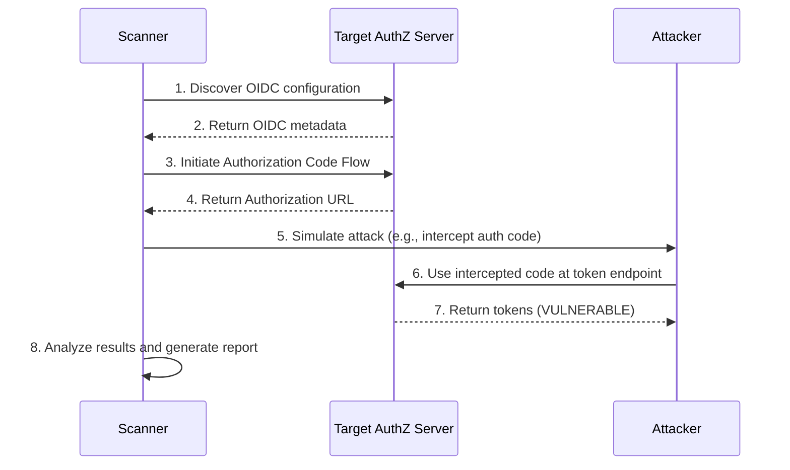

# Product Requirements Document (PRD)
## Runtime Security Scanner

**Version**: 1.0
**Status**: Draft
**Author**: Matt Bordenet
**Created**: October 9, 2025
**Target Completion**: October 10, 2025

---

## Executive Summary

A runtime security scanner for OAuth2/OIDC implementations. This tool will perform dynamic analysis by simulating common attacks against a live authorization server.

**Key Innovation**: Active simulation of attack scenarios to provide concrete evidence of vulnerabilities.

---

## Problem Statement

### Business Context
Static analysis can only go so far. Runtime analysis is needed to detect vulnerabilities that only manifest in a running system.

### Technical Challenges
- Simulating complex multi-step attack flows.
- Handling different OAuth2/OIDC provider implementations.
- Differentiating between expected failures and actual vulnerabilities.

---

## Goals & Non-Goals

### Goals ✅
1.  Simulate common OAuth2/OIDC attacks.
2.  Provide clear and actionable reports.
3.  Be easy to configure and run.

### Non-Goals ❌
1.  Fuzzing or denial-of-service attacks.
2.  Exploiting vulnerabilities beyond demonstrating their existence.

---

## Functional Requirements

### FR-1: OIDC Discovery
**Priority**: P0 (Must Have)

**Description**: The scanner must be able to discover the OIDC configuration of the target server.

**Acceptance Criteria**:
- ✅ Fetch and parse the OIDC discovery document.
- ✅ Extract key endpoints (authorization, token, userinfo, jwks).

### FR-2: Attack Simulation
**Priority**: P0 (Must Have)

**Description**: The scanner must simulate the following attacks:
- **CSRF**: Attempt to initiate an authorization flow without a state parameter.
- **Authorization Code Interception**: Simulate an attacker intercepting the authorization code and exchanging it for tokens.
- **Token Replay**: Attempt to use the same token multiple times.

**Acceptance Criteria**:
- ✅ Each attack simulation is implemented as a separate check.
- ✅ The scanner reports whether each attack was successful or not.

### FR-3: Reporting
**Priority**: P0 (Must Have)

**Description**: The scanner must generate a report of its findings.

**Acceptance Criteria**:
- ✅ The report is available in human-readable and JSON formats.
- ✅ The report includes details of each attack simulated and the outcome.

---

## Technical Architecture

### High-Level Architecture

```
┌──────────────────┐      ┌──────────────────────┐
│  Scanner (Go)    │─────▶│ Target AuthZ Server  │
│                  │      │ (OAuth2/OIDC)        │
│                  │◀─────│                      │
└──────────────────┘      └──────────────────────┘
```

### Flows

#### Runtime Scanning Process



---

## Implementation Plan

### Phase 1: Core Scanner (4 hours)
- [ ] Project setup, Go module.
- [ ] OIDC discovery client.
- [ ] Basic HTTP client for interacting with the target server.

### Phase 2: Attack Modules (4 hours)
- [ ] CSRF attack module.
- [ ] Authorization code interception module.
- [ ] Token replay module.

### Phase 3: Reporting & CLI (2 hours)
- [ ] JSON and human-readable report generators.
- [ ] Cobra CLI for running the scanner.

---

## Success Metrics

- ✅ The scanner can successfully identify all targeted vulnerabilities in a test environment.
- ✅ The scanner can be configured to run against a live server.
- ✅ The reports are clear and actionable.
