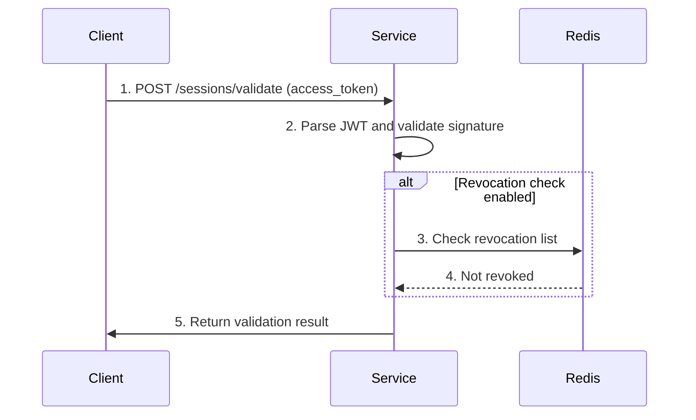

# Product Requirements Document (PRD)
## Multi-Tenant Session Management Service

**Version**: 1.0
**Status**: Draft → Implementation
**Author**: Matt Bordenet
**Created**: October 8, 2025
**Target Completion**: October 10, 2025

---

## Executive Summary

A distributed, horizontally-scalable session management service designed for multi-tenant identity platforms. Demonstrates understanding of session management at global scale with requirements similar to large multi-brand platforms (e.g., Expedia's portfolio of travel brands).

**Key Innovation**: Hybrid approach combining stateless [JWT](https://datatracker.ietf.org/doc/html/rfc7519) validation (fast path) with distributed [Redis](https://redis.io) storage (security/revocation path) to achieve both performance and security requirements.

---

## Problem Statement

### Business Context
Modern identity platforms serving multiple brands face critical session management challenges:

1. **Multi-Brand Isolation**: Sessions for different brands must be cryptographically isolated
2. **Global Scale**: Hundreds of millions of users across geographic regions
3. **High Availability**: 99.99% uptime requirement (< 52 minutes downtime/year)
4. **Security**: Immediate revocation capability for compromised sessions
5. **Performance**: < 10ms p99 latency for session validation

### Technical Challenges
- **Stateful Sessions Don't Scale**: Traditional server-side sessions hit memory/network bottlenecks
- **Stateless Tokens Aren't Revocable**: Pure [JWT](https://datatracker.ietf.org/doc/html/rfc7519) approach can't handle logout/security events
- **Multi-Region Consistency**: Global deployments need eventual consistency across regions
- **Tenant Isolation**: Signing keys, session data, metrics must be isolated per tenant

---

## Goals & Non-Goals

### Goals ✅
1. **Demonstrate scale thinking** appropriate for enterprise identity platforms
2. **Implement production patterns**: Graceful shutdown, health checks, observability
3. **Prove performance**: Load test sustaining 10K+ concurrent sessions
4. **Show multi-tenant architecture**: Isolated keys, namespaced data, separate metrics
5. **Document trade-offs**: Stateless vs stateful, consistency vs availability

### Non-Goals ❌
1. **Not building full production system** - demonstrating patterns at smaller scale
2. **Not implementing every [OAuth2](https://datatracker.ietf.org/doc/html/rfc6749)/[OIDC](https://openid.net/specs/openid-connect-core-1_0.html) feature** - focus on session management
3. **Not building distributed tracing** - observability hooks only
4. **Not implementing multi-region replication** - single-region with replication design
5. **Not building admin UI** - [CLI](https://en.wikipedia.org/wiki/Command-line_interface)/[API](https://en.wikipedia.org/wiki/API) only

---

## User Personas

### 1. Platform Engineer (Primary)
**Name**: Sarah Chen
**Role**: Senior Platform Engineer at multi-brand travel company
**Goals**:
- Deploy session service that scales to 100M+ users
- Achieve < 10ms p99 latency for session validation
- Support immediate logout across all devices
- Isolate sessions per brand for security/compliance

**Pain Points**:
- Current monolithic session store is performance bottleneck
- Can't revoke [JWT](https://datatracker.ietf.org/doc/html/rfc7519) tokens issued before security incident
- No visibility into session metrics per brand
- Difficult to test session failover scenarios

**Success Metrics**:
- Service handles 100K req/sec session validations
- Token revocation propagates globally in < 1 second
- Zero downtime during [Redis](https://redis.io) cluster maintenance
- Per-tenant session metrics in [Prometheus](https://prometheus.io)

---

### 2. Security Engineer
**Name**: Marcus Rodriguez
**Role**: Application Security Engineer
**Goals**:
- Immediate revocation for compromised sessions
- Cryptographic isolation between tenants
- Audit trail for session lifecycle events
- Automated rotation of signing keys

**Pain Points**:
- Pure [JWT](https://datatracker.ietf.org/doc/html/rfc7519) approach can't revoke tokens before expiration
- Shared signing keys mean compromise affects all tenants
- No audit trail for session creation/deletion
- Key rotation requires service restart

**Success Metrics**:
- Revoked sessions denied within 1 request
- Each tenant has isolated RSA key pair
- All session events logged with tenant context
- Key rotation with zero downtime

---

### 3. Application Developer
**Name**: Jessica Kim
**Role**: Full-stack developer building customer-facing apps
**Goals**:
- Simple SDK to validate sessions in microservices
- Clear documentation and examples
- Local development environment
- Comprehensive error messages

**Pain Points**:
- Complex session validation logic duplicated across services
- Difficult to test session expiration scenarios
- Unclear when to use access token vs refresh token
- Poor error messages make debugging hard

**Success Metrics**:
- One-line session validation in app code
- [Podman Compose](https://github.com/containers/podman-compose) for local testing
- < 5 minutes to integrate SDK
- Actionable error messages with remediation steps

---

## Functional Requirements

### FR-1: Session Creation
**Priority**: P0 (Must Have)

**Description**: Generate [JWT](https://datatracker.ietf.org/doc/html/rfc7519) tokens with tenant-specific signing keys

**Acceptance Criteria**:
- ✅ Create session with user ID, tenant ID, scope
- ✅ Generate access token ([JWT](https://datatracker.ietf.org/doc/html/rfc7519), [RS256](https://datatracker.ietf.org/doc/html/rfc7518#section-3.3), 15-minute expiry)
- ✅ Generate refresh token ([JWT](https://datatracker.ietf.org/doc/html/rfc7519), [RS256](https://datatracker.ietf.org/doc/html/rfc7518#section-3.3), 30-day expiry)
- ✅ Store refresh token in [Redis](https://redis.io) with tenant namespace
- ✅ Return token pair to client
- ✅ Support custom claims (email, roles, etc.)

**API**:
```http
POST /sessions
Content-Type: application/json

{
  "tenant_id": "brand-a",
  "user_id": "user-123",
  "scope": "profile email",
  "metadata": {
    "email": "user@example.com",
    "roles": ["customer"]
  }
}

Response 201:
{
  "access_token": "eyJhbGc...",
  "refresh_token": "eyJhbGc...",
  "token_type": "Bearer",
  "expires_in": 900
}
```

---

### FR-2: Session Validation
**Priority**: P0 (Must Have)

**Description**: Validate access tokens with fast-path [JWT](https://datatracker.ietf.org/doc/html/rfc7519) verification and slow-path revocation check

**Acceptance Criteria**:
- ✅ Validate [JWT](https://datatracker.ietf.org/doc/html/rfc7519) signature with tenant's public key
- ✅ Verify expiration, issuer, audience claims
- ✅ Check revocation blocklist in [Redis](https://redis.io) (if present)
- ✅ Return parsed claims on success
- ✅ Return specific error codes (expired, revoked, invalid signature)
- ✅ Cache public keys for performance

**API**:
```http
POST /sessions/validate
Content-Type: application/json

{
  "access_token": "eyJhbGc..."
}

Response 200:
{
  "valid": true,
  "claims": {
    "sub": "user-123",
    "tenant_id": "brand-a",
    "scope": "profile email",
    "exp": 1696800000
  }
}

Response 401:
{
  "valid": false,
  "error": "token_expired",
  "error_description": "Token expired at 2025-10-08T12:00:00Z"
}
```

**Performance Target**: < 5ms p99 latency (JWT-only fast path)

---

### FR-3: Token Refresh
**Priority**: P0 (Must Have)

**Description**: Exchange refresh token for new access token

**Acceptance Criteria**:
- ✅ Validate refresh token from [Redis](https://redis.io)
- ✅ Check not expired or revoked
- ✅ Generate new access token (same claims)
- ✅ Optionally rotate refresh token (security best practice)
- ✅ Update last_used timestamp in [Redis](https://redis.io)
- ✅ Support sliding window expiration

**API**:
```http
POST /sessions/refresh
Content-Type: application/json

{
  "refresh_token": "eyJhbGc..."
}

Response 200:
{
  "access_token": "eyJhbGc...",
  "refresh_token": "eyJhbGc...",  // New refresh token (optional rotation)
  "token_type": "Bearer",
  "expires_in": 900
}
```

---

### FR-4: Session Revocation
**Priority**: P0 (Must Have)

**Description**: Immediately invalidate sessions (logout, security events)

**Acceptance Criteria**:
- ✅ Revoke specific access token by token ID
- ✅ Revoke specific refresh token
- ✅ Revoke all sessions for user ID
- ✅ Revoke all sessions for tenant (security incident)
- ✅ Add to [Redis](https://redis.io) blocklist with TTL matching token expiration
- ✅ Support batch revocation (performance)

**API**:
```http
POST /sessions/revoke
Content-Type: application/json

{
  "token": "eyJhbGc...",
  "reason": "user_logout"
}

Response 204: No Content

---

POST /sessions/revoke-all
Content-Type: application/json

{
  "user_id": "user-123",
  "tenant_id": "brand-a",
  "reason": "security_incident"
}

Response 200:
{
  "revoked_count": 3
}
```

---

### FR-5: Multi-Tenant Key Management
**Priority**: P0 (Must Have)

**Description**: Isolated RSA signing keys per tenant with rotation support

**Acceptance Criteria**:
- ✅ Generate RSA-2048 key pair per tenant on first session
- ✅ Store private key encrypted in [Redis](https://redis.io)
- ✅ Cache public keys in memory for validation performance
- ✅ Support key rotation with grace period (old + new keys valid)
- ✅ [JWKS](https://datatracker.ietf.org/doc/html/rfc7517) endpoint per tenant (public key distribution)
- ✅ Automatic key rotation every 90 days

**API**:
```http
GET /tenants/{tenant_id}/jwks
Response 200:
{
  "keys": [
    {
      "kty": "RSA",
      "use": "sig",
      "alg": "RS256",
      "kid": "brand-a-2025-10-08",
      "n": "xGOr...",
      "e": "AQAB"
    }
  ]
}
```

---

### FR-6: Health & Observability
**Priority**: P1 (Should Have)

**Description**: Health checks, metrics, and distributed tracing hooks

**Acceptance Criteria**:
- ✅ Health endpoint ([Redis](https://redis.io) connectivity, key availability)
- ✅ [Prometheus](https://prometheus.io/) metrics (request rate, latency, error rate)
- ✅ Per-tenant metrics (session count, revocation rate)
- ✅ Structured logging with tenant context
- ✅ Distributed tracing hooks ([OpenTelemetry](https://opentelemetry.io/) compatible)

**Metrics**:
- `sessions_created_total{tenant_id}`
- `sessions_validated_total{tenant_id,result}` (result: valid/expired/revoked)
- `sessions_refreshed_total{tenant_id}`
- `sessions_revoked_total{tenant_id,reason}`
- `session_validation_duration_seconds{tenant_id}` (histogram)
- `redis_operations_total{operation,status}`

**API**:
```http
GET /health
Response 200:
{
  "status": "healthy",
  "redis": "connected",
  "uptime_seconds": 3600
}

GET /metrics
Response 200: (Prometheus format)
sessions_created_total{tenant_id="brand-a"} 12345
session_validation_duration_seconds_bucket{tenant_id="brand-a",le="0.005"} 9500
```

---

## Non-Functional Requirements

### NFR-1: Performance
- **Session Validation**: < 5ms p99 latency (JWT-only path)
- **Session Validation with Revocation Check**: < 10ms p99 latency
- **Session Creation**: < 20ms p99 latency
- **Token Refresh**: < 15ms p99 latency
- **Throughput**: Support 10K+ concurrent sessions (load test validated)

### NFR-2: Availability
- **Uptime**: 99.9% (design target, not enforced in demo)
- **Graceful Degradation**: Continue [JWT](https://datatracker.ietf.org/doc/html/rfc7519) validation if [Redis](https://redis.io) temporarily unavailable
- **Graceful Shutdown**: Finish in-flight requests before shutdown (15-second timeout)
- **Health Checks**: Kubernetes-compatible liveness/readiness probes

### NFR-3: Scalability
- **Horizontal Scaling**: Stateless service, add replicas for more throughput
- **[Redis](https://redis.io) Cluster**: Support 3+ node [Redis](https://redis.io) cluster for HA
- **Multi-Region Ready**: Design supports read replicas in other regions
- **Tenant Isolation**: Performance of one tenant doesn't impact others

### NFR-4: Security
- **Signing Algorithm**: [RS256](https://datatracker.ietf.org/doc/html/rfc7518#section-3.3) (RSA-2048 minimum)
- **Key Isolation**: Separate RSA key pair per tenant
- **Token Expiration**: Short-lived access tokens (15 minutes)
- **Revocation**: Immediate invalidation via [Redis](https://redis.io) blocklist
- **Audit Logging**: All session operations logged with tenant/user context

### NFR-5: Observability
- **Metrics**: [Prometheus](https://prometheus.io/)-compatible, per-tenant labels
- **Logging**: Structured [JSON](https://www.json.org/) logs (compatible with ELK, Splunk)
- **Tracing**: [OpenTelemetry](https://opentelemetry.io/) hooks for distributed tracing
- **Dashboards**: [Grafana](https://grafana.com/) dashboard included with key metrics

### NFR-6: Developer Experience
- **Documentation**: Complete [API](https://en.wikipedia.org/wiki/API) reference, architecture diagrams
- **Local Development**: [Podman Compose](https://github.com/containers/podman-compose) one-liner
- **SDK**: Go client library for easy integration
- **Examples**: Sample applications demonstrating all flows

---

## Technical Architecture

### High-Level Architecture

```
┌─────────────────────────────────────────────────────────────┐
│                      Application Layer                      │
│  ┌──────────────┐  ┌──────────────┐  ┌──────────────┐     │
│  │  Web App 1   │  │  Web App 2   │  │  API Service │     │
│  │  (brand-a)   │  │  (brand-b)   │  │              │     │
│  └──────┬───────┘  └──────┬───────┘  └──────┬───────┘     │
└─────────┼──────────────────┼──────────────────┼────────────┘
          │                  │                  │
          │ POST /sessions/validate (access_token)
          │                  │                  │
          ▼                  ▼                  ▼
┌─────────────────────────────────────────────────────────────┐
│              Session Management Service (Go)                │
│                                                             │
│  ┌────────────────────────────────────────────────────────┐│
│  │  HTTP Handlers                                         ││
│  │  - POST /sessions (create)                            ││
│  │  - POST /sessions/validate (validate)                 ││
│  │  - POST /sessions/refresh (refresh)                   ││
│  │  - POST /sessions/revoke (revoke)                     ││
│  │  - GET /tenants/{id}/jwks (public keys)              ││
│  │  - GET /health, /metrics                              ││
│  └────────────────────────────────────────────────────────┘│
│                           │                                 │
│  ┌────────────────────────┼────────────────────────────┐   │
│  │  Core Services         │                            │   │
│  │  ┌──────────────┐ ┌────▼──────────┐ ┌────────────┐ │   │
│  │  │ JWT Manager  │ │ Session Store │ │ Key Manager│ │   │
│  │  │ (RS256)      │ │ (Redis ops)   │ │ (per-tenant│ │   │
│  │  └──────────────┘ └───────────────┘ └────────────┘ │   │
│  └────────────────────────────────────────────────────┘   │
└──────────────────────────┬──────────────────────────────────┘
                           │
                           ▼
                 ┌───────────────────┐
                 │  Redis Cluster    │
                 │  ┌─────────────┐  │
                 │  │  Sessions   │  │  Namespaced keys:
                 │  │  Refresh    │  │  - tenant:brand-a:refresh:token:{id}
                 │  │  Revoked    │  │  - tenant:brand-a:revoked:{token}
                 │  │  Keys       │  │  - tenant:brand-a:keys:private
                 │  └─────────────┘  │
                 └───────────────────┘
```

### Flows

#### Session Validation Flow



---

### Data Flow: Session Validation (Fast Path)

```
1. Client → Service: POST /sessions/validate {"access_token": "eyJ..."}
2. Service: Parse JWT header (extract tenant_id from claims)
3. Service: Load tenant's public key (cached in memory)
4. Service: Validate JWT signature locally (NO Redis call)
5. Service: Check expiration claim
6. Service → Client: 200 OK {"valid": true, "claims": {...}}

Timeline: ~2-5ms
```

### Data Flow: Session Validation (With Revocation Check)

```
1. Client → Service: POST /sessions/validate {"access_token": "eyJ..."}
2. Service: Parse JWT, validate signature (same as fast path)
3. Service: Extract token ID (jti claim)
4. Service → Redis: EXISTS tenant:brand-a:revoked:{jti}
5. Redis → Service: 0 (not revoked)
6. Service → Client: 200 OK {"valid": true, "claims": {...}}

Timeline: ~5-10ms (Redis round-trip)
```

---

### Redis Data Model

**Refresh Tokens**:
```
Key: tenant:{tenant_id}:refresh:{token_id}
Value: JSON serialized RefreshToken struct
TTL: 30 days (2592000 seconds)
```

**Revocation Blocklist**:
```
Key: tenant:{tenant_id}:revoked:{token_id}
Value: "1" (simple flag)
TTL: Matches token expiration (auto-cleanup)
```

**Tenant Keys**:
```
Key: tenant:{tenant_id}:keys:private
Value: PEM-encoded RSA private key (encrypted)
TTL: None (permanent until rotation)

Key: tenant:{tenant_id}:keys:public
Value: PEM-encoded RSA public key
TTL: None (permanent until rotation)
```

**Session Metadata** (optional, for metrics):
```
Key: tenant:{tenant_id}:sessions:{user_id}
Value: Set of active session IDs
TTL: None (cleaned up on revocation)
```

---

## Technology Stack

### Core Technologies
- **Language**: [Go 1.21+](https://go.dev) - Performance, concurrency, single binary
- **Token Format**: [JWT (RFC 7519)](https://datatracker.ietf.org/doc/html/rfc7519) - Industry standard
- **Signing Algorithm**: [RS256 (RFC 7518)](https://datatracker.ietf.org/doc/html/rfc7518) - Asymmetric, secure
- **Storage**: [Redis 7+](https://redis.io) - Fast, distributed, TTL support

### Dependencies
- **HTTP Router**: [gorilla/mux](https://github.com/gorilla/mux) - Flexible routing
- **JWT Library**: [golang-jwt/jwt](https://github.com/golang-jwt/jwt) - Standard JWT implementation
- **Redis Client**: [go-redis/redis](https://github.com/go-redis/redis) - Production-ready client
- **Metrics**: [Prometheus client](https://github.com/prometheus/client_golang) - Standard metrics
- **Config**: [spf13/viper](https://github.com/spf13/viper) - Configuration management

### Infrastructure
- **Container**: [Podman](https://podman.io/) - Reproducible builds
- **Orchestration**: [Podman Compose](https://github.com/containers/podman-compose) - Local development
- **Load Testing**: [k6](https://k6.io) - Modern load testing
- **Monitoring**: [Prometheus](https://prometheus.io) + [Grafana](https://grafana.com) - Observability

---

## Implementation Plan

### Phase 1: Core Session Management (4 hours)
**Goal**: Basic session create/validate/refresh working

- [ ] Project structure and models
  - Session, Token, Claims data structures
  - Error types (ErrExpired, ErrRevoked, ErrInvalidSignature)

- [ ] JWT Manager
  - GenerateAccessToken (RS256, 15min TTL)
  - GenerateRefreshToken (RS256, 30d TTL)
  - ValidateToken (signature, expiration)

- [ ] Redis Session Store
  - StoreRefreshToken
  - GetRefreshToken
  - DeleteRefreshToken
  - Namespaced keys per tenant

- [ ] HTTP Handlers
  - POST /sessions (create)
  - POST /sessions/validate (validate)
  - POST /sessions/refresh (refresh)

**Deliverable**: Can create session, validate access token, refresh token

---

### Phase 2: Multi-Tenant Key Management (2 hours)
**Goal**: Isolated signing keys per tenant

- [ ] Key Manager
  - GenerateKeyPair (RSA-2048)
  - GetPrivateKey(tenantID)
  - GetPublicKey(tenantID)
  - StoreKeys (Redis, encrypted)
  - LoadKeys (on startup, lazy load)

- [ ] JWKS Endpoint
  - GET /tenants/{tenant_id}/jwks
  - Convert RSA public key to JWK format

- [ ] Key Caching
  - In-memory cache for public keys
  - LRU eviction policy (max 1000 keys)

**Deliverable**: Each tenant has isolated RSA key pair

---

### Phase 3: Revocation & Security (1 hour)
**Goal**: Immediate session revocation capability

- [ ] Revocation Handler
  - POST /sessions/revoke (single token)
  - POST /sessions/revoke-all (all user sessions)

- [ ] Revocation Store
  - AddToBlocklist(tokenID, ttl)
  - IsRevoked(tokenID)
  - RevokeAllForUser(userID)

- [ ] Enhanced Validation
  - Check blocklist during validation
  - Fast-path option (skip revocation check)

**Deliverable**: Can revoke sessions, validation checks blocklist

---

### Phase 4: Load Testing & Performance (2 hours)
**Goal**: Validate 10K+ concurrent sessions with metrics

- [ ] Load Test Scripts (k6)
  - Scenario 1: Session creation (100 req/sec)
  - Scenario 2: Validation (10K req/sec)
  - Scenario 3: Refresh (50 req/sec)
  - Scenario 4: Mixed workload

- [ ] Performance Tuning
  - Key caching optimization
  - Connection pooling (Redis)
  - Goroutine limits

- [ ] Metrics Collection
  - Prometheus metrics endpoint
  - Grafana dashboard
  - Latency histograms

**Deliverable**: Load test report, Grafana dashboard

---

### Phase 5: Observability & Documentation (1 hour)
**Goal**: Production-ready observability and docs

- [ ] Health Checks
  - GET /health (Redis connectivity)
  - Kubernetes liveness/readiness

- [ ] Structured Logging
  - Request logging with tenant context
  - Error logging with stack traces
  - Access logs

- [ ] Documentation
  - Architecture diagram
  - API reference
  - Deployment guide
  - Load test results

- [ ] Examples
  - Sample client application
  - SDK usage examples

**Deliverable**: Complete documentation, sample apps

---

## Success Metrics

### Technical Metrics
- ✅ Session validation: < 5ms p99 (JWT-only)
- ✅ Session validation: < 10ms p99 (with revocation check)
- ✅ Load test: Sustain 10K concurrent sessions
- ✅ Load test: 100K+ total sessions validated
- ✅ Zero errors during Redis failover (graceful degradation)

### Code Quality Metrics
- ✅ Unit test coverage: > 80%
- ✅ Integration tests: All API endpoints
- ✅ Error handling: Comprehensive, actionable messages
- ✅ Documentation: Architecture diagrams, API reference
- ✅ Observability: Metrics, logging, tracing hooks

### Learning Metrics
- ✅ Demonstrates understanding of distributed session management
- ✅ Shows trade-offs (stateless vs stateful, consistency vs availability)
- ✅ Applies multi-tenant isolation patterns
- ✅ Proves performance at scale (10K+ sessions)
- ✅ Interview-ready talking points

---

## Risks & Mitigations

### Risk 1: Redis Cluster Complexity
**Impact**: High
**Probability**: Medium
**Mitigation**: Start with single-node Redis, document cluster setup, test failover scenarios

### Risk 2: Key Management Security
**Impact**: High
**Probability**: Low
**Mitigation**: Encrypt private keys at rest, use Redis AUTH, document key rotation process

### Risk 3: Performance Under Load
**Impact**: Medium
**Probability**: Medium
**Mitigation**: Early load testing, profiling, caching optimizations, connection pooling

### Risk 4: Multi-Tenant Leakage
**Impact**: Critical
**Probability**: Low
**Mitigation**: Comprehensive unit tests for tenant isolation, code review, security audit

### Risk 5: Time Constraint
**Impact**: Medium
**Probability**: Medium
**Mitigation**: Prioritize P0 features, defer P1 features if needed, focus on core functionality

---

## Open Questions

1. **Key Rotation Strategy**: Manual trigger vs automatic every 90 days?
   - **Decision**: Manual trigger for demo, document automatic approach

2. **Revocation Propagation**: How fast must revocation propagate in multi-region?
   - **Decision**: Single-region demo, design supports < 1 second propagation

3. **Session Limits**: Should we limit sessions per user?
   - **Decision**: No hard limit for demo, track metrics for visibility

4. **Refresh Token Rotation**: Rotate on every refresh or only on suspicious activity?
   - **Decision**: Optional rotation (configurable), default = no rotation for simplicity

---

## References

### Standards & Specifications
- [RFC 7519 - JSON Web Tokens (JWT)](https://datatracker.ietf.org/doc/html/rfc7519)
- [RFC 7518 - JSON Web Algorithms (JWA)](https://datatracker.ietf.org/doc/html/rfc7518)
- [RFC 7515 - JSON Web Signature (JWS)](https://datatracker.ietf.org/doc/html/rfc7515)
- [RFC 7517 - JSON Web Key (JWK)](https://datatracker.ietf.org/doc/html/rfc7517)

### Best Practices
- [OWASP Session Management Cheat Sheet](https://cheatsheetseries.owasp.org/cheatsheets/Session_Management_Cheat_Sheet.html)
- [JWT Best Practices](https://datatracker.ietf.org/doc/html/rfc8725)
- [Redis Best Practices](https://redis.io/docs/management/optimization/)

### Architecture Patterns
- [Multi-Tenant Architecture](https://docs.microsoft.com/en-us/azure/architecture/guide/multitenant/overview)
- [Circuit Breaker Pattern](https://martinfowler.com/bliki/CircuitBreaker.html)
- [Graceful Degradation](https://en.wikipedia.org/wiki/Graceful_degradation)

---

## Appendix

### Example: Session Lifecycle

```
1. User Login → Application
   Application → Session Service: POST /sessions
   {
     "tenant_id": "brand-a",
     "user_id": "alice",
     "scope": "profile email"
   }

   Session Service → Redis: Store refresh token
   Session Service → Application: Return token pair
   {
     "access_token": "eyJ... (15min TTL)",
     "refresh_token": "eyJ... (30d TTL)"
   }

2. API Request → Application
   Application → Session Service: POST /sessions/validate
   {
     "access_token": "eyJ..."
   }

   Session Service: Validate JWT locally (no Redis)
   Session Service → Application: Return claims
   {
     "valid": true,
     "claims": {"sub": "alice", "tenant_id": "brand-a"}
   }

3. Access Token Expired → Application
   Application → Session Service: POST /sessions/refresh
   {
     "refresh_token": "eyJ..."
   }

   Session Service → Redis: Validate refresh token
   Session Service: Generate new access token
   Session Service → Application: Return new token pair

4. User Logout → Application
   Application → Session Service: POST /sessions/revoke
   {
     "refresh_token": "eyJ...",
     "reason": "user_logout"
   }

   Session Service → Redis: Add to blocklist
   Session Service → Redis: Delete refresh token
   Session Service → Application: 204 No Content
```

---

**Document Status**: Ready for Implementation
**Next Steps**: Phase 1 - Core Session Management
**Estimated Completion**: 10 hours total
